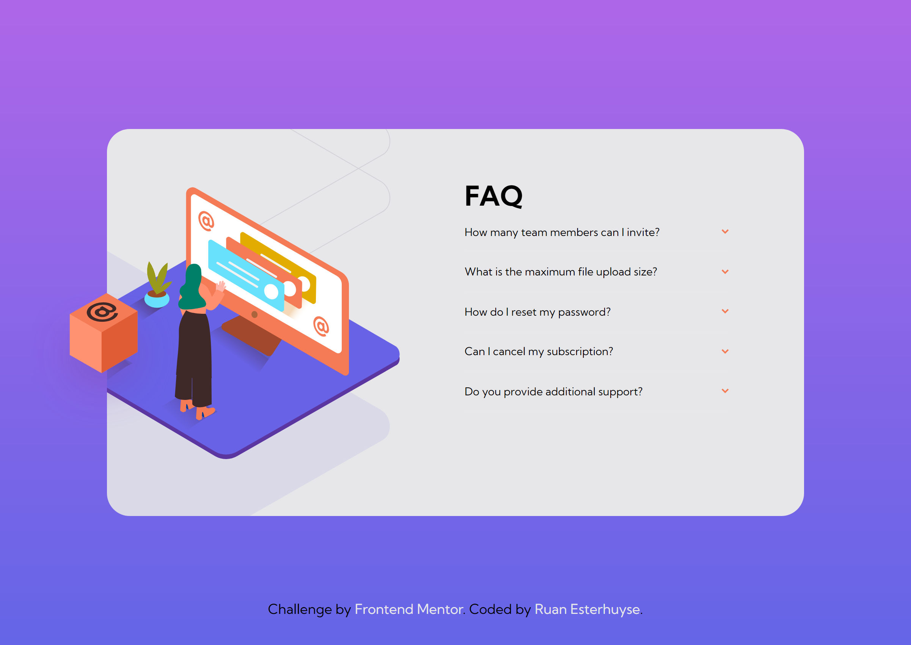
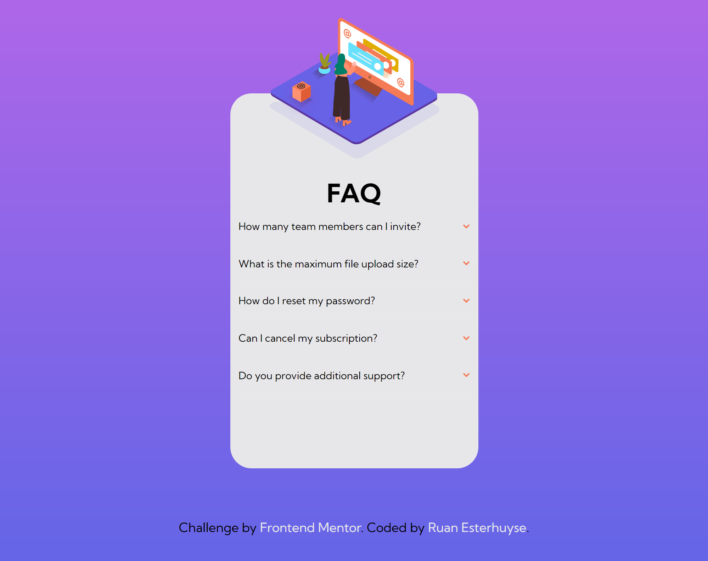

# Frontend Mentor - FAQ-accordion-card

This is my solution to the [FAQ-accordion-card challenge on Frontend Mentor](https://www.frontendmentor.io/challenges/faq-accordion-card-XlyjD0Oam/hub/faq-accordion-card-dpV_ZfGBsK). Frontend Mentor challenges help you improve your coding skills by building realistic projects.

### Screenshot

### Built with

- HTML5
- CSS
- JavaScript

## Author

- Frontend Mentor - [@Ruan Esterhuyse](https://www.frontendmentor.io/profile/RuanEsterhuyse)
